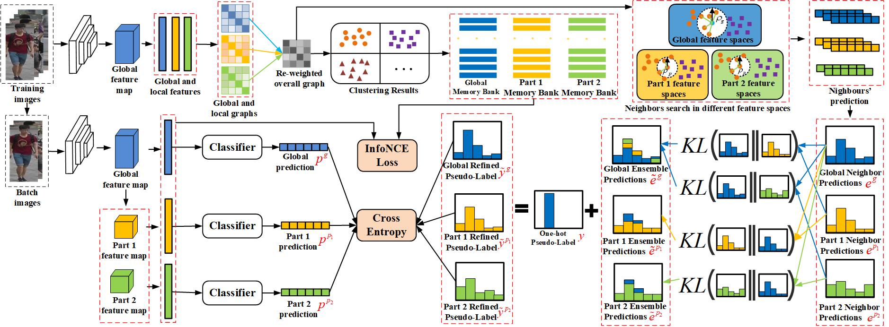

# NCPLR

The is the *official* repository with Pytorch version for [Neighbour Consistency Guided Pseudo-Label Refinement for Unsupervised Person Re-Identification]

## Catalogue

- [1. Introduction](#1)
- [2. Instillation](#2)
- [3. Preparation](#3)
- [4. Train](#4)
- [5. Test](#5)
- [6. Main Results](#6)
- [7. References](#7)
<!-- - [8. Citation](#8) -->


<a name='1'></a>
## 1. Introduction

Neighbour Consistency guided Pseudo Label Refinement (NCPLR) can be regarded as a transductive form of label propagation under the assumption that the prediction of each example should be similar to its nearest neighbours'. Specifically, the refined label for each training instance can be obtained from the original clustering result and a weighted ensemble of its neighbours' predictions, with weights determined according to their similarities in the feature space. Furthermore, we also explore building a unified global-local NCPLR mechanism through a global-local label iteration module to achieve mutual label refinement. Such a strategy promotes efficient complementary learning while mitigating some unreliable information, finally improving the quality of the refined pseudo labels for each global-local region. Extensive experimental results demonstrate the effectiveness of the proposed method, showing superior performance to state-of-the-art methods by a large margin.




<a name='2'></a>
## 2. Instillation

- Python 3.7.8
- Pytorch 1.2.0
- Torchvision 0.4.0
- Faiss-gpu 1.6.4

<a name='3'></a>
## 3. Preparation
Prepare dataset  
    &emsp;&emsp;a. Download datasets: Market-1501 and MSMT17 (from [Aliyun](https://virutalbuy-public.oss-cn-hangzhou.aliyuncs.com/share/data.zip))  
    &emsp;&emsp;b. Move them to ```#~/../data/```  
    &emsp;&emsp;c. Insure the data folder like the following structure (otherwise you should modify the data path in ```~/ncplr/datasets/[DATANAME].py```):
```
$GL-NCPLR/data
    market1501
      Market-1501-v15.09.15
          bounding_box_train
          bounding_box_test
          query
    msmt17
      MSMT17_V1
        bounding_box_train
        bounding_box_test
        query
```

<a name='4'></a>
## 4. Train

You can simply run `train.sh ` file for the transferring testing process.

```
# python gl-ncplr_train.py -b 256 -a resnet50_neighbor -d market1501 --momentum 0.1 --eps 0.5 --num-instances 16 --height 320 --use-refinelabels --ce-option 1 --eps-neighbor 0.2 --alpha 0.1 --cmalpha 0.3 --topk-s 0 --topk-spart 0 --use-part --use-mixdistneighbbor --eps-partneighbor 0.2 --lambda1 0.2 --lambda2 0.2 --extra-option 2 --temp-KLlogits 5.0 --temp-KLloss 5.0 --logs logs/market1501/gl-ncplr
```

<a name='5'></a>
## 5. Test

You can simply run `test.sh ` file for the transferring testing process.

```
# python gl-ncplr_test.py -a resnet50_neighbor -d market1501 --logs logs/market1501/ncplr --resume checkpoints/market1501/ncplr

# python gl-ncplr_test.py -a resnet50_neighbor -d market1501 --logs logs/market1501/gl-ncplr --resume checkpoints/market1501/gl-ncplr

# python gl-ncplr_test.py -a resnet50_neighbor -d msmt17 --logs logs/msmt17/ncplr --resume checkpoints/msmt17/ncplr

# python gl-ncplr_test.py -a resnet50_neighbor -d msmt17 --logs logs/msmt17/gl-ncplr --resume checkpoints/msmt17/gl-ncplr
```

<a name='6'></a>
## 6. Main Results

The main results are on Market1501 (M) and MSMT17 (MS). The downloaded model checkpoints are placed in ```#~/checkpoints/[DATANAME]/[METHOD]/model best.pth.tar```, e.g., ```checkpoints/market1501/gl-ncplr/model_best.pth.tar```

| Methods | M | Link | MS | Link |
| --- | -- | -- | -- | - |
| CC | 82.0 (92.2) | - | 35.2 (65.5) | - |
| CC + NCPLR | 85.5 (94.4) | - | 40.3 (69.1) | - |
| CC + Gl-NCPLR  | **86.9 (94.6)** | [CC_NCPLR_M](https://drive.google.com/file/d/1wg28B41w1Uuj87_WcZ6h_d_KDXz38mmA/view?usp=sharing) | **41.7 (70.0)** | [CC_NCPLR_MS](https://drive.google.com/file/d/1i7y04qIEPvB9J7mxzwX56hDK1wH0TgEM/view?usp=sharing) |
| DCMIP | 86.0 (94.3) | - | 39.9 (68.1) | - |
| DCMIP + NCPLR | 87.2 (95.0) | - | 42.5 (69.9) | - |
| DCMIP + Gl-NCPLR  | **87.8 (95.2)** | [DCMIP_NCPLR_M](https://drive.google.com/file/d/10GHJeTBO4ZrD6yK2PPx6QE6n0eGZKVfU/view?usp=sharing) | **43.0 (70.8)** | [DCMIP_NCPLR_MS](https://drive.google.com/file/d/1Pd4zvf_uOBPlWQ872vHwdg7plk8pGQS3/view?usp=sharing) |

<a name='7'></a>
## 7. References
[1] Our code is conducted based on [ClusterContrast](https://github.com/alibaba/cluster-contrast-reid).

[2] [Cluster Contrast for Unsupervised Person Re-Identification](https://arxiv.org/pdf/2103.11568v3.pdf)


<!-- <a name='8'></a>
## 8. Citation

If you find this code useful in your research, please kindly consider citing our paper:

    @inproceedings{zhang2022implicit,
      title={Implicit Sample Extension for Unsupervised Person Re-Identification},
      author={Zhang, Xinyu and Li, Dongdong and Wang, Zhigang and Wang, Jian and Ding, Errui and Shi, Javen Qinfeng and Zhang, Zhaoxiang and Wang, Jingdong},
      booktitle={Proceedings of the IEEE/CVF Conference on Computer Vision and Pattern Recognition},
      pages={7369--7378},
      year={2022}
    } -->

